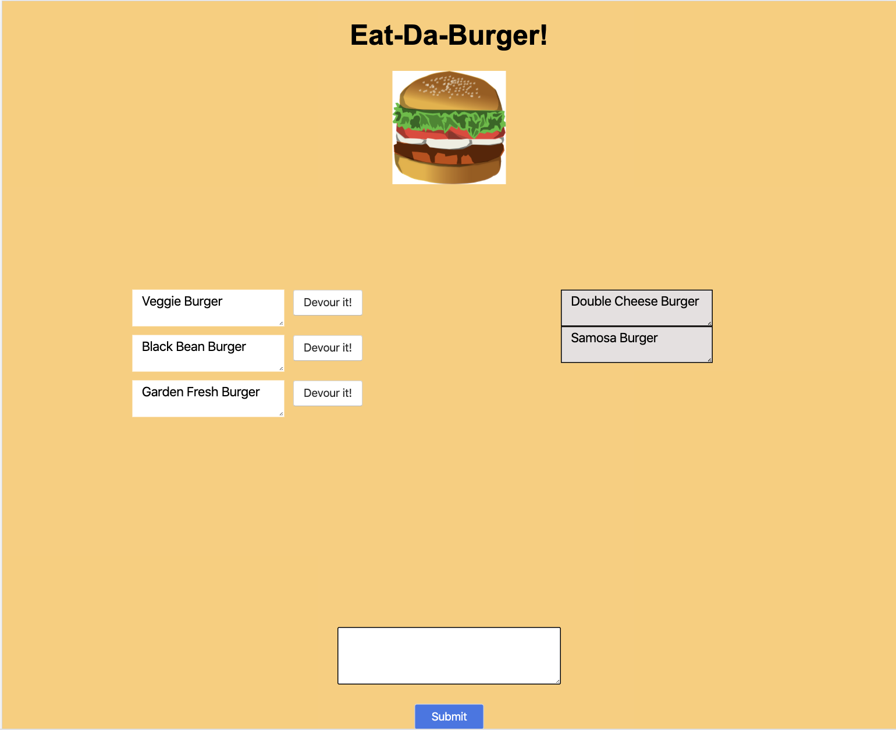

# burger
Using Node Express Handlebars 

## Description:
This is a restaurant app that lets users input the names of burgers they'd like to eat.

## Usage:

1. Whenever a user submits a burger's name, the app will display the burger on the left side of the page  waiting to be devoured.

2. Each burger in the waiting area has a Devour it! button. When the user clicks on it, the burger will move to the right side of the page.

3. The app will store every burger in a database, whether devoured or not.

## Technologies:

Handlebars,CSS, MySQL, Node, Express, ORM

## Screenshot:

